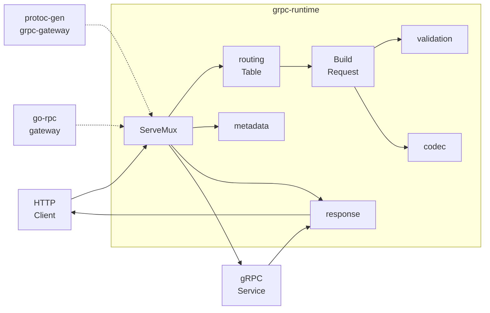
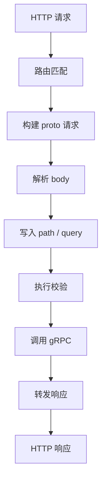

<div align="center">

# grpc-runtime

### 高性能 gRPC HTTP Runtime · 路由绑定 · Metadata · Codec · Response Pipeline

[](https://go.dev/)
[](LICENSE)
[]()
[]()

</div>

---

## 为什么选择 grpc-runtime？

`grpc-runtime` 是 `protoc-gen-grpc-gateway` 生成代码的运行时内核，负责把 HTTP 请求稳定地转换为 gRPC 调用，并把 gRPC 响应转换回 HTTP 输出

它不承担业务网关的启动、连接池、日志链路和服务治理职责；这些能力由 `go-rpc-gateway` 等上层框架注入`grpc-runtime` 专注于一件事：让生成代码保持轻薄，把路由、绑定、校验、metadata 和 response 这些公共流程收敛在运行时

| 特性 | 能力 | 价值 |
|------|------|------|
| **生成器友好** | `RouteDesc`、`BodyBinding`、`QueryFilter`、`RouteInvoker` | 生成代码只描述路由和强类型调用，不再重复生成底层 plumbing |
| **高性能路由** | static exact index、template/trie、legacy Pattern fallback | 静态路由快速命中，复杂模板保留兼容语义 |
| **统一请求构建** | body decode、path params、query params、field mask、validation | 入口流程集中维护，减少各服务生成代码差异 |
| **完整响应管线** | unary、stream、error、trailer、rewriter、content length | HTTP 输出行为一致，兼容 gRPC Gateway 语义 |
| **可插拔校验** | `WithRequestValidator`、`WithValidationErrorFormatter`、`WithValidationSkipper` | 上层可接入 go-argus 或自定义 validator |
| **兼容迁移** | 保留 `NewPattern`、`HandlerFunc`、`PopulateQueryParameters` 等旧入口 | 新旧生成器可以分阶段切换 |

---

## 系统架构



### 运行时请求链路



---

## 快速开始

### 安装

```bash
go get github.com/kamalyes/grpc-runtime
```

### 创建 ServeMux

```go
package main

import (
	"context"
	"net/http"

	runtime "github.com/kamalyes/grpc-runtime"
)

func main() {
	mux := runtime.NewServeMux(
		runtime.WithWriteContentLength(),
	)

	_ = runtime.RegisterRoutes(context.Background(), mux, []runtime.RouteDesc{
		{
			Method:      http.MethodGet,
			Template:    "/v1/users/{user_id}",
			Operation:   "/apex.api.UserService/UserGet",
			Request:     func() proto.Message { return new(UserGetRequest) },
			Body:        runtime.NoBody(),
			QueryFilter: runtime.QueryFilter("user_id"),
			Invoker:     invokeUserGet,
		},
	})

	_ = http.ListenAndServe(":8080", mux)
}
```

> 实际项目中，`RouteDesc` 和 `invokeUserGet` 通常由 `protoc-gen-grpc-gateway` 自动生成

### 生成器侧推荐输出

```go
var userRoutes = []runtime.RouteDesc{
	{
		Method:      http.MethodPost,
		Template:    "/v1/users",
		Operation:   "/apex.api.UserService/UserCreate",
		Request:     func() proto.Message { return new(UserCreateRequest) },
		Body:        runtime.Body("user"),
		QueryFilter: runtime.QueryFilter(),
		Invoker:     invokeUserCreate,
	},
}
```

生成代码只需要保留强类型 invoker：

```go
func invokeUserCreate(ctx context.Context, req proto.Message, target any) (proto.Message, runtime.ServerMetadata, error) {
	in := req.(*UserCreateRequest)
	client := target.(UserServiceClient)

	var md runtime.ServerMetadata
	out, err := client.UserCreate(
		ctx,
		in,
		grpc.Header(&md.HeaderMD),
		grpc.Trailer(&md.TrailerMD),
	)
	return out, md, err
}
```

---

## 模块说明

| 模块 | 职责 |
|------|------|
| `routing` | 路由表、静态索引、模板编译、trie 匹配、path params 池化 |
| `binding` | body/query/field mask 绑定描述，承接新生成器请求构建语义 |
| `metadata` | HTTP header、gRPC metadata、timeout、server metadata 上下文桥接 |
| `codec` | JSONPb、builtin JSON、proto、HTTPBody marshaler 与 registry |
| `response` | HTTP status、error、unary/stream response forwarding |
| `validation` | 请求校验接口、错误格式化和跳过策略 |
| `scalar` | proto scalar、well-known type、enum、wrapper 类型转换 |
| `httprule` | google.api.http path template 解析与编译 |
| `utilities` | legacy double-array trie、reader factory、flag helper |

---

## 与 go-rpc-gateway 的关系

`grpc-runtime` 是底层 runtime，`go-rpc-gateway` 是上层企业级网关框架

| 项目 | 负责内容 |
|------|----------|
| `grpc-runtime` | HTTP 到 gRPC 的运行时转换、路由匹配、请求绑定、响应转发 |
| `protoc-gen-grpc-gateway` | 从 proto 生成 `RouteDesc`、binding 描述和 typed invoker |
| `go-rpc-gateway` | 服务启动、配置、日志、链路追踪、指标、中间件、治理能力 |

推荐边界：

```text
protoc-gen-grpc-gateway -> 生成轻量 RouteDesc
grpc-runtime            -> 执行统一 runtime pipeline
go-rpc-gateway          -> 注入上层网关能力
```

---

## 常用能力

### 路由注册

```go
err := runtime.RegisterRoutes(ctx, mux, routes)
```

### 请求校验

```go
mux := runtime.NewServeMux(
	runtime.WithRequestValidator(validator),
	runtime.WithValidationErrorFormatter(formatValidationError),
)
```

### Header 与 Trailer 转发

```go
mux := runtime.NewServeMux(
	runtime.WithIncomingHeaderMatcher(runtime.DefaultHeaderMatcher),
	runtime.WithOutgoingHeaderMatcher(runtime.DefaultHeaderMatcher),
	runtime.WithOutgoingTrailerMatcher(runtime.DefaultHeaderMatcher),
)
```

### 响应重写

```go
mux := runtime.NewServeMux(
	runtime.WithForwardResponseRewriter(func(ctx context.Context, msg proto.Message) (any, error) {
		return map[string]any{"result": msg}, nil
	}),
)
```

---

## 测试

```bash
go test ./...
```

常用定向测试：

```bash
go test ./routing -run TestTable
go test ./response -run TestForwardResponseStream
go test ./metadata -run TestAnnotateContext
```

性能基准：

```bash
go test ./routing -bench=. -benchmem
go test . -bench=PopulateQueryParameters -benchmem
```

---

## 文档

| 文档 | 说明 |
|------|------|
| [RUNTIME_REFACTOR.md](./RUNTIME_REFACTOR.md) | runtime 分层、生成器边界和后续重构路线 |
| [routing/](./routing/) | 路由表、模板编译、trie、静态索引实现 |
| [binding/](./binding/) | 请求绑定描述和 query/field mask 逻辑 |
| [response/](./response/) | 响应转发、状态码和错误映射 |
| [metadata/](./metadata/) | metadata 注入、timeout 编解码和 stream 上下文 |

---

## 相关项目

- [go-rpc-gateway](https://github.com/kamalyes/go-rpc-gateway) - 企业级微服务网关框架
- [protoc-gen-grpc-gateway](https://github.com/kamalyes/protoc-gen-grpc-gateway) - grpc-runtime 配套生成器
- [protoc-gen-openapiv2](https://github.com/kamalyes/protoc-gen-openapiv2) - OpenAPI v2 文档生成器
- [go-toolbox](https://github.com/kamalyes/go-toolbox) - 通用工具集
- [go-argus](https://github.com/kamalyes/go-argus) - 参数校验与错误格式化

---

## 贡献与支持

欢迎提交 issue、补充测试和完善文档

```bash
git checkout -b feature/runtime-improvement
go test ./...
git commit -m "feat: improve grpc runtime"
```

- [报告 Bug](https://github.com/kamalyes/grpc-runtime/issues)
- [功能建议](https://github.com/kamalyes/grpc-runtime/issues)
- [提交代码](https://github.com/kamalyes/grpc-runtime/pulls)

---

## 开源协议

本项目采用 [MIT License](LICENSE) 开源协议

---

<div align="center">

**如果这个项目对你有帮助，欢迎给一个 Star 支持**

Built with love by [Kamalyes](https://github.com/kamalyes)

[回到顶部](#grpc-runtime)

</div>
